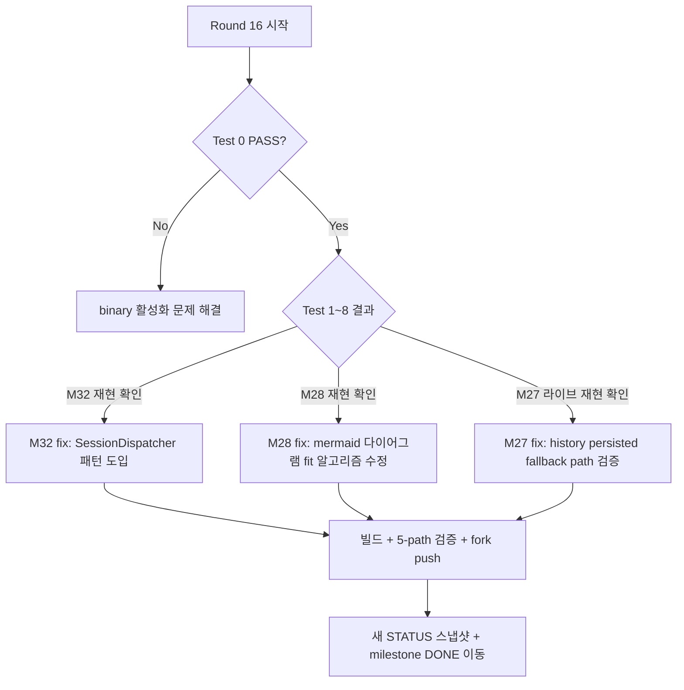

# Lazydino Jcode — 현재 상태 스냅샷 (Round 15 종료 시점)

날짜: 2026-05-11
관련 문서: `LAZYDINO_MILESTONES.md` (전체 milestone 본문), `LAZYDINO_MAINTENANCE.md` (커밋된 패치 이력)

이 문서는 **현 시점의 배포 상태, 5-path sha256 검증 결과, 그리고 OPEN milestone 의 권장 처리 순서** 만 요약합니다. milestone 상세는 `LAZYDINO_MILESTONES.md` 본문을 참조.

---

## 1. 배포 상태 (Deploy state)

| 항목 | 값 |
|---|---|
| HEAD commit | `70371eda` (`deploy/m9-m27-catchup` branch) |
| 합성 베이스 | upstream `50d2c68b` (origin/master) + 130 lazydino commits squashed |
| 변경 규모 | 174 files, +20,581 / -723 lines |
| Binary version string | `jcode 0.12.180-dev (9ebd5714)` |
| Binary sha256 | `665bddf93f4052415a4f1966308da27f309726862505e73546d17f04138a1b21` |
| Cargo build | `cargo +nightly build --release` ✅ (2m 18s) |
| Cargo check (workspace) | `cargo +nightly check --workspace` ✅ |
| Cargo check (tests) | `cargo +nightly check --tests --workspace` ✅ (52.97s) |
| Cargo test (workspace) | ⚠️ 29 fail in parallel / **all PASS in isolation** — race/ordering, NOT a real bug → M29 |

### 5-path sha256 검증 (모두 동기)

| Path | Real path (`readlink -f`) | sha256 prefix |
|---|---|---|
| `target/release/jcode` | (self, 88 MB ELF) | `665bddf93f40...` |
| `~/.jcode/builds/versions/lazydino-88a90347/jcode` | (self, 88 MB ELF) | `665bddf93f40...` |
| `~/.jcode/builds/stable/jcode` | → `versions/lazydino-88a90347/jcode` (symlink) | `665bddf93f40...` |
| `~/.jcode/builds/current/jcode` | → `versions/lazydino-88a90347/jcode` (symlink) | `665bddf93f40...` |
| `~/.local/bin/jcode` | (self, 88 MB ELF, install copy) | `665bddf93f40...` |

⚠️ 주의: 사용자 PATH 우선순위에 따라 `which jcode` 는 `~/.local/bin/jcode` 또는 `~/.jcode/builds/current/jcode` 둘 중 하나로 잡힘. 둘 다 같은 sha256 이므로 안전.

### Fork 상태 (lazy-dinosaur/jcode)

| Branch | Tip commit | 용도 |
|---|---|---|
| `deploy/m9-m27-catchup` | `70371eda` | 현 배포 |
| `backup/deploy-m9-m10-pre-catchup-20260511-225725Z` | `ea04ddf6` | M21 ver.2 직전 안전망 |
| `deploy/m9-m10` | `ea04ddf6` | 옛 배포 (M21 ver.2 직전 동일 commit) — 역사 보존 |

---

## 2. 떠있는 jcode-server process

| PID | 상태 | binary |
|---|---|---|
| (없음) | — | — |

✅ 현재 떠있는 jcode-server 없음. 다음 라이브 검증 시작은 깨끗한 상태에서 출발.

---

## 3. OPEN milestone 처리 권장 순서

(상세 본문은 `LAZYDINO_MILESTONES.md` 의 해당 M<N> 섹션 참조)

| 순위 | ID | 제목 (요약) | 우선순위 | 사용자 직접 영향 |
|---|---|---|---|---|
| 1 | **M32** | Assistant streaming events 의 sibling client fanout 누락 | High | 라이브 회귀 — bg wake / multi-attach 시 응답 안 보임 |
| 2 | **M31** | bg tool 결과의 LLM 자동 주입 (auto-enqueue) | High | autonomy 핵심 — bg 결과 못 받으면 사용자가 매번 물어야 함 |
| 3 | **M30** | bg `notify=true` 가 wake 전달 안 함 | Medium-High | autonomy + UX |
| 4 | **M28** | Mermaid 다이어그램 우하단 클리핑 | Medium-High | feature usability (큰 다이어그램 사용 불가) |
| 5 | **M27** | busy-agent history fallback 두 건 (pre-existing) | Medium | 실사용 영향 미확정 (라이브 재현 우선) |
| 6 | **M24** | 일반 tool round-내 병렬 실행 (M22 후속) | Medium-High | 디버그 효율 |
| 7 | **M17** | main↔swarm queue 라우팅 (claude-code parity) | High | 사용자 워크플로우 |
| 8 | **M16** | Anthropic OAuth 광고 schema 의 ToolDefinition 통일 | Medium-High | 미래 회귀 방지 (구조 개선) |
| 9 | **M29** | test 격리/순서 의존성 오염 | Medium | **사용자 영향 0** (CI hygiene only) |
| 10 | **M23** | build artifact retention policy | Low | 디스크 충분 동안 보류 |
| 11 | **M33** | 이미지 클립보드 paste 시 silent fail (Round 16 라이브) | Low | UX (실패 이유 표시 없음) |
| 12 | **M34** | `schedule` tool 광고 schema vs deserialize struct field 이름 mismatch (Round 16 라이브) | Medium-High | LLM 자주 사용, 일관 실패 가능 |
| 13 | **M35** | Lifecycle hook 결과의 LLM 다음 turn 자동 주입 (feedback loop 완성, Round 16 라이브 질문) | High | autonomy + hook 활용도 직결 |

---

## 4. Round 15 라이브 검증 체크리스트 (사용자 직접 실행)

(상세는 round 14 마지막 assistant message 의 Test 0~8 참조 — 본 문서에서는 핵심 명령만 발췌)

### Test 0 — 새 binary 활성화

```bash
# 외부 터미널에서:
pkill -9 -f "jcode .* server" 2>/dev/null
jcode --version          # 기대: 0.12.180-dev (9ebd5714)
which jcode              # 기대: ~/.local/bin/jcode (또는 builds/current/jcode)
sha256sum $(readlink -f $(which jcode)) | head -c 16   # 기대: 665bddf93f405241
```

### Test 1~8 — 기능별 검증

| Test | 검증 대상 | 통과 기준 |
|---|---|---|
| 1 | TUI boot + basic prompt | jcode 진입, prompt 응답 |
| 2 | M15 sibling user-message fanout (text + image, 2-client attach) | 한 client 에서 보낸 user message 가 다른 client 화면에 즉시 표시 |
| 3 | **M28** mermaid clipping 재현 | 큰 mermaid (≥6 노드) 가 아래/오른쪽 잘리는지 |
| 4 | hooks lifecycle (session.start/stop, response.completed) | 후크 발화 확인 (1번만 — M9 dedupe) |
| 5 | swarm spawn × 2 worker | 두 worker 모두 작업 끝나면 main 에 결과 보고 |
| 6 | ambient scheduler | 시간 기반 wake 정상 (M30 안 깨졌으면 PASS) |
| 7 | **M27** busy-agent history live repro | long turn 중 다른 client 가 `get_history` 시 messages 비지 않는지 |
| 8 | **M29** single-test PASS 재확인 | `cargo test bus::tests::models_updated_publishes_are_coalesced` 등 단일 실행 PASS |

### 사용자가 보고할 정보

각 test 별:
1. 명령 출력 (또는 TUI 스크린샷)
2. PASS / FAIL
3. FAIL 인 경우 어디서 끊긴 느낌인지 (단어 한두 개라도 OK)

---

## 5. 다음 Round 진행 의사 결정 트리



권장: Round 16 첫 작업은 **M32 fix** (사용자 라이브 회귀, 우선순위 High, fix 패턴 명확 — `SessionDispatcher` 도입). 단 작업 시작 전 Test 0 (binary 활성화) 가 PASS 인지 사용자 확인 필요.

---

## 6. 이번 Round 15 에서 닫힌 항목 요약

| ID | 결과 |
|---|---|
| M21 → M21 ver.2 | ✅ DONE (squash-rebase, 174 files, 5-path 동기) |
| M22 | ✅ BY-DESIGN (subagent serial = upstream 의도, 일반 tool 병렬은 M24 분리) |
| M25 | 🟡 PRE-CLOSED BY-DESIGN (swarm worker cleanup = upstream fire-and-forget 정책) |
| M26 | 🟡 PRE-CLOSED BY-DESIGN (swarm await_completion = upstream fire-and-forget 정책) |

새로 등록:

| ID | 발견 경위 |
|---|---|
| M28 | 사용자 라이브 ��고 (mermaid 우하단 클리핑) |
| M29 | M21 ver.2 빌드 직후 `cargo test --workspace` 시 29 fail 발견 (격리 시 모두 PASS) |
| M30 | 사용자 라이브 보고 (bg notify 누락 — 37초 늦게 사용자가 직접 확인) |
| M31 | 사용자 명시 (autonomy 핵심 — bg 결과 자동 주입) |
| M32 | Round 14 마지막 라이브 진단 (assistant streaming sibling broadcast 누락) |

---

## 7. Round 16 라이브 검증 결과 (진행 중)

| Test | 결과 | 메모 |
|---|---|---|
| 0 | (예정) | binary 활성화 확인 — 아직 명시 보고 없음 (단, 사용자가 TUI 안에서 mermaid 프롬프트 실행한 것 보아 실제로는 새 binary 떠 있는 것으로 추정) |
| 1 | (예정) | TUI boot — 묵시적 PASS (Test 2/3 진행됨) |
| 2 | ⚠️ **부분 FAIL** | 이미지 클립보드 paste 시 `Reading clipboard...` 만 깜빡 → silent fail. 진단: 클립보드에 image MIME 없음 (`wl-paste --list-types` = text/plain only). 추가 보고: "지금 스크린샷도 전혀 안들어가" — 별도 스크린샷 첨부도 실패. 별도 milestone **M33** 등록 |
| 3 | 🔴 **FAIL — 큰 신호** | mermaid 다이어그램이 이미지로 렌더 안 되고 **`┌─ mermaid` 박스 안에 raw `flowchart LR ...` 텍스트 그대로 표시**. 진단 (코드/Cargo.toml read 로 확정): `mermaid-renderer` feature 가 top-level `Cargo.toml` 의 `default` 에 없음 → 모든 `#[cfg(feature = "renderer")]` 코드가 binary 에서 통째로 빠짐. 환경 OK (Kitty terminal, mmdc v11.12.0, puppeteer chrome cache). **사전 결함** (backup branch 도 동일). M28 본문 전면 갱신 — 클리핑 추정 → renderer feature disabled 로 재정의. 우선순위 Low-Medium → **High** 로 격상 |
| 4 | ✅ **PASS (기본 발화)** + 후속 enhancement 등록 | hook 로그상 정상 발화 확인 (`/tmp/jcode-session-stop.log`, `/tmp/jcode-response-completed.log` 둘 다 정상 기록). 사용자가 핵심 질문 제기: "훅을 다시 결과로 받아서 진행하는게 중요한거지??" → 현 상태 분석: `tool.execute.before` deny ✅, `response.completed` deny+continuation ✅ (M11 stage 6), 그러나 `tool.execute.after` stdout 의 LLM 자동 주입 ❌, `inject` action 없음, async hook 결과 회수 path 없음. 새 milestone **M35** 등록 (autonomy 강화) |
| 5 | (예정) | swarm spawn × 2 worker |
| 6 | 🔴 **FAIL — 두 가지 버그** | (i) `schedule` 첫 호출 `error: invalid type: null, expected string` → field 이름 mismatch (`task` advertised vs `context` parsed) → 새 milestone **M34** 등록. (ii) 1분 후 ambient wake 가 due 되어 assistant 응답 생성됐으나 **UI 에 안 보임** → **M32 의 또 다른 재현** (이미 bg complete wake 에서 봤던 것과 동일 root cause, 본문에 ambient wake 사례 누적) |
| 7~8 | (예정) | |

### 진행 규칙

- Test 가 fail 할 때마다 새 milestone 으로 등록 (M33 처럼)
- 모든 Test 완료 후 Round 17 시작 시 우선순위 재정렬
- 큰 발견 (M28 같은 feature flag 사전 결함) 은 milestone 본문 자체를 라이브 진단 결과로 갱신

### 누적된 라이브 진단 발견 (Round 16)

1. **M28 → 본문 전면 갱신** (Round 16): "우하단 클리핑" 추정 → 실제로는 **renderer feature disabled** 가 root cause. fix path 두 옵션 (default features 수정 vs install 스크립트 수정) 명시. backup branch 도 동일 상태 — M21 ver.2 회귀 아닌 사전 결함.
2. **M33 신규 등록** (Round 16): 이미지 클립보드 paste silent fail UX.
3. **사용자 라이브 환경 확인**:
   - Terminal: Kitty (`TERM=xterm-kitty`, `KITTY_WINDOW_ID=1`) — image protocol 지원 OK
   - Display: Wayland (`WAYLAND_DISPLAY=wayland-1`), `wl-paste`/`xclip` 둘 다 설치
   - mmdc: `/home/lazydino/.npm-global/bin/mmdc` v11.12.0, puppeteer chrome cache (`~/.cache/puppeteer/chrome` 2025-02-21 빌드) 존재
   - chromium/google-chrome 별도 미설치 (mmdc 가 puppeteer 사용)
4. **hook 환경 확인** (Test 4 준비):
   - `~/.jcode/config.toml` 에 **기존 [hooks] 섹션 이미 존재** (처음 보고: 부재 → 정정: `head -50` 만 본 실수). `session.stop` + `response.completed` 만 정의, 둘 다 `tee -a /tmp/jcode-*.log`, blocking=true, timeout 3s.
   - `~/.jcode/hooks/test-*.sh` (5개: session-stop, response-completed, tool-before, tool-after, client-disconnect) 신규 작성 — config 에는 추가 안 됨 (기존 hook 보존), 필요시 수동 추가.
   - 검증 시나리오 A (response.completed 1회), B (session.stop 1회), C (jcode run 단발 모드 flush, M10) 명시.
5. **M32 본문에 누적 (Round 16 Test 6)**: ambient wake 도 동일 증상 — 즉 (1) bg complete wake, (2) ambient schedule wake 두 종류의 server-initiated turn 모두 sibling client 에 broadcast 안 됨. M32 가 더 일반적 결함임을 확인.
6. **M34 신규 등록 (Round 16 Test 6)**: `schedule` tool 광고 schema (`task`) vs deserialize 구조체 (`context: String`) 필드 이름 mismatch → 첫 호출 시 일관되게 실패. `deserialize_string_or_option_u32` 중복 정의도 동시 발견 (build warning 후보).
7. **M35 신규 등록 (Round 16 Test 4 후속)**: 사용자가 "훅을 다시 결과로 받아서 진행하는게 중요한거지??" 질문. 현 상태 분석: lifecycle hook 기본 발화는 OK 지만 `tool.execute.after` stdout 의 LLM 자동 주입 없음, `inject` action 없음, async hook 결과 회수 path 없음. M31 (bg tool 자동 주입) 과 같은 결의 autonomy 핵심.
