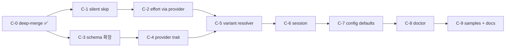

# M47 — Provider-agnostic agent profile 차원 분리 (model/variant/effort/context/thinking)

**Priority**: High (lazy-harness 의 multi-provider 페르소나 SSOT 전제조건)
**Status**: In Progress
**Discovered**: 2026-05-17 lazy-harness §2.4 record 작성 중, sisyphus/prometheus/atlas 등의 4-provider (Claude/GPT/Gemini/GLM) 일관 표현을 시도하다 발견.
**Custom patch type**: lazy-harness 전용. upstream PR 아님. **각 단계를 독립 `patch/m47-*` 브랜치로 분리**. upstream rebase 후 patch branch 를 순서대로 cherry-pick / merge 해서 재적용.

## 한 줄 요약

`AgentRouteConfig` 와 `ProviderConfig` 의 OpenAI 편향을 해소해서, model · variant · effort · context · thinking 의 5 차원이 직교적으로 표현되고, 4 provider (Claude / GPT / Gemini / GLM-OpenRouter) 가 각자 관심 차원만 자연스럽게 소비하도록 만든다. lazy-harness 가 한 SSOT 로 4-provider 페르소나를 정의할 수 있게 한다.

## 브랜치 전략

기존 `patch/agent-profiles*` 패턴을 그대로 따른다. 각 단계가 하나의 `patch/m47-c{N}-...` 브랜치 = 1-3 commits 의 self-contained 패치. 마지막 commit 은 `docs: record m47-c{N} patch` 로 LAZYDINO_MAINTENANCE.md 의 patch ledger 갱신.

```
master (upstream)
  └─ patch/m47-c0-deep-merge-profiles      ← 이미 분리됨 (commit 539c8f47)
       └─ patch/m47-c1-effort-silent-skip
            └─ patch/m47-c2-effort-apply-via-provider
                 └─ patch/m47-c3-route-config-context-thinking
                      └─ patch/m47-c4-provider-trait-dimensions
                           └─ patch/m47-c5-variant-resolver
                                └─ patch/m47-c6-session-preferences
                                     └─ patch/m47-c7-provider-config-defaults
                                          └─ patch/m47-c8-doctor-effective-dimensions
                                               └─ patch/m47-c9-sample-agent-md
```

각 브랜치는:
- 부모 브랜치 위에 stack 되어 자기 변경만 포함.
- 컴파일/테스트 자체 검증 가능 (의존하는 부모만 있으면 됨).
- 작업 중인 `deploy/m9-m27-catchup` 같은 통합 브랜치는 모든 patch 들의 머지 결과.
- upstream rebase 시: 새 upstream 위에 patch branch 를 순서대로 다시 cherry-pick 또는 ours-merge.

## 배경 — 발견된 갭

현재 잘 되는 것:
- `~/.jcode/agents/*.md`, `<project>/.jcode/agents/*.md` 가 frontmatter + body 로 profile 정의를 잘 받음 (`agent_profiles_md.rs`).
- `[agents.profiles.*]` toml 와 markdown 둘 다 지원. host wins per-key deep-merge 도 `patch/m47-c0-deep-merge-profiles` (commit `539c8f47`) 로 완료.
- subagent spawn 시 `prompt_with_profile` 가 profile 의 prompt/description/when 을 prepend.

OpenAI 편향 갭 (현 시점 2026-05-17):
1. **`ProviderConfig` 가 OpenAI 키 일색**: `openai_reasoning_effort`, `openai_transport`, `openai_service_tier`, `openai_native_compaction_*`, `openai_parallel_tool_calls`. Claude / Gemini / GLM 의 reasoning/context/thinking 차원을 표면 노출하는 키 없음.
2. **`Provider::set_reasoning_effort` 가 미지원 provider 면 hard error 반환** (`src/provider/mod.rs:1502`). `restore_reasoning_effort_from_session` 가 그 에러를 잡아 `error!` 로깅 → Claude 메인 세션 + config 의 `openai_reasoning_effort` 잔존 시 노이즈.
3. **`should_apply_route_effort` 가 `gpt-*` / `openai/*` 만 통과** (`src/tool/task.rs:148`). 그러나 `provider/mod.rs` 의 `set_reasoning_effort` 는 OpenRouter (DeepSeek/GLM 등) 도 통과시킴 → **내부 모순**.
4. **`AgentRouteConfig` 에 context / thinking 차원이 없음**. Claude 의 1M context 는 `variant="max"` → `[1m]` suffix 부착이라는 우회로만 가능. Gemini 의 thinking budget, Anthropic 의 extended thinking, OpenRouter Kimi/GLM 의 thinking 등은 profile 에서 표현 불가.
5. **`variant="max"` 가 provider-aware 매핑이지만 코드에 흩어져 있음** (`apply_route_variant_to_model`, `normalize_route_effort` 의 `"max" => "xhigh"`). Gemini/GLM 추가 시 매번 두 곳을 같이 손봐야 함.

## 목표 시맨틱 — 5 차원 직교 분리

| 차원 | 의미 | 값 예시 |
|---|---|---|
| `model` | 모델 ID literal | `claude-opus-4-7`, `gpt-5.5`, `gemini-3.1-pro-preview`, `glm-4-6` |
| `variant` | "이 provider 의 가장 강력한 옵션" 별칭. provider-aware 로 풀림 | `max`, `pro`, `fast` |
| `effort` | reasoning effort | `none`/`low`/`medium`/`high`/`xhigh` |
| `context` | context window 선택 | `200k`, `1m` |
| `thinking` | thinking/extended-thinking 활성 | `true`/`false` (M49 에서 정수 budget 확장) |

### Provider × variant="max" 매핑

| Provider | variant="max" 가 풀리는 차원 |
|---|---|
| Claude | `context := "1m"` (model 에 `[1m]` 부착) |
| GPT/OpenAI | `effort := "xhigh"` |
| Gemini | `thinking := true` (또는 max budget) |
| GLM/OpenRouter | `effort := "xhigh"` 또는 `thinking := true` (모델별) |

### 차원별 적용 매트릭스

| 차원 | Claude | GPT | Gemini | GLM |
|---|---|---|---|---|
| effort | ❌ silent skip | ✅ | ❌ skip | ✅ (지원 모델만) |
| context | ✅ `[1m]` 부착 | ❌ (model 별 고정) | ❌ (자동) | ❌ |
| thinking | ✅ (4.7+) | ❌ (내장) | ✅ budget | ✅ (Kimi/일부) |

미지원 차원이 set 되어도 silent skip. debug 로그로만 흔적.

## 성공 기준

1. 4 provider 페르소나를 한 SSOT (markdown) 로 정의 가능.
2. 각 profile 의 5 차원이 의도대로 작동 (Claude effort → skip / GPT effort → 반영 / Gemini thinking → 반영 / GLM variant=max → 적절 매핑).
3. `provider.set_reasoning_effort` 가 미지원 provider 면 silent skip, error 로깅 없음.
4. `jcode doctor` 가 effective 5 차원 + 적용 여부 표시.
5. 기존 사용자 config 무변경 동작 (`[1m]` 직접 표기, `variant=max` 그대로).
6. 모든 테스트 통과 + 신규 4-provider matrix 테스트 추가.

## 비목표 (이번 마일스톤 밖)

- TUI picker 의 context/thinking cycle UI (→ M48).
- Gemini thinking_budget 정수 표현 (→ M49).
- 새 provider 추가 시 declarative mapping table (→ M50).
- prompt body 의 md 파일 로딩 (이미 동작).

## 단계별 patch branch 계획

각 단계는 하나의 `patch/m47-c{N}-...` 브랜치. 단계 마지막 commit 은 `docs: record m47-c{N} patch` 로 LAZYDINO_MAINTENANCE.md ledger 추가.

### C-0. Deep-merge agent profiles per key (✅ 완료, branch: `patch/m47-c0-deep-merge-profiles`)

- **Commit**: `539c8f47 agents: deep-merge profiles per key so host configs can override one field`
- **Status**: ✅ Done (이미 deploy/m9-m27-catchup 에 머지됨, branch 회수됨)
- **남은 작업**: LAZYDINO_MAINTENANCE ledger 항목 추가 (별도 docs commit).

### C-1. `set_reasoning_effort` silent skip 통합 (`patch/m47-c1-effort-silent-skip`)

- **목표**: 미지원 provider 에 effort set 시 `Ok(())` + debug 로그. 노이즈 제거.
- **변경 파일**:
  - `src/provider/mod.rs::set_reasoning_effort` 의 `_ => Err(...)` → `Ok(())` + debug 로그.
  - `src/agent/provider.rs::restore_reasoning_effort_from_session` 의 `error!` → `debug!`.
- **검증**: `cargo test -p jcode --lib provider::tests`, openrouter 테스트 회귀 없음.
- **회귀 위험**: 매우 낮음.
- **부모 브랜치**: `patch/m47-c0-deep-merge-profiles` (혹은 master 위 독립, 둘 다 가능).

### C-2. `should_apply_route_effort` provider-aware 통합 (`patch/m47-c2-effort-apply-via-provider`)

- **목표**: `task.rs` 와 `provider/mod.rs` 의 effort 지원 판정 단일화.
- **변경 파일**:
  - `src/tool/task.rs::should_apply_route_effort` 제거 또는 `provider.available_efforts().is_empty() == false` 로 위임.
  - DeepSeek/GLM 같은 OpenRouter reasoning 모델에 route effort 적용 시작.
- **검증**: `route_effort_applies_only_to_openai_style_models` 테스트 갱신, DeepSeek/GLM 케이스 추가.
- **회귀 위험**: 낮음 (의도된 확장).
- **부모 브랜치**: `patch/m47-c1-effort-silent-skip`.

### C-3. `AgentRouteConfig` 에 `context`, `thinking` 차원 추가 (`patch/m47-c3-route-config-context-thinking`)

- **목표**: profile 스키마에 직교 차원 추가.
- **변경 파일**:
  - `crates/jcode-config-types/src/lib.rs::AgentRouteConfig` 에 `context: Option<String>`, `thinking: Option<bool>` 추가.
  - `AgentRouteConfig::merge_from` (C-0) 가 두 키도 deep-merge.
  - `src/agent_profiles_md.rs::parse_agent_md_file` 가 frontmatter `context`, `thinking`, `thinking-budget` (alias) 인식.
- **검증**: frontmatter 파싱 + deep-merge 테스트 확장.
- **회귀 위험**: 낮음 (optional 필드).
- **부모 브랜치**: `patch/m47-c0-deep-merge-profiles` (C-1/C-2 와 독립).

### C-4. Provider trait 에 context/thinking 메서드 (`patch/m47-c4-provider-trait-dimensions`)

- **목표**: provider 가 자기 지원 차원을 선언. route apply 가 위임.
- **변경 파일**:
  - `crates/jcode-provider-core/src/lib.rs::Provider` 에 `available_contexts() -> Vec<&'static str>`, `supports_thinking() -> bool`, `set_context_preference(&str) -> Result<()>`, `set_thinking(bool) -> Result<()>` 추가. default impl 은 빈 / false / `Ok(())`.
  - `src/provider/anthropic.rs`: contexts=["200k","1m"], `set_context_preference` 가 model 에 `[1m]` 부착/제거. thinking=true (4.7+ 모델).
  - `src/provider/gemini.rs`: supports_thinking=true, `set_thinking` 이 thinking_budget API 인자에 반영.
  - `src/provider/openrouter.rs`: 기존 `thinking_override` env → provider 메서드로 승격.
  - `src/provider/openai.rs`: default skip (변경 없음).
  - `src/provider/mod.rs::MultiProvider` 가 active provider 메서드 위임.
- **검증**: provider 별 단위 테스트 (set 후 model / request body 검증).
- **회귀 위험**: 중. provider 코드 다수 손댐. C-4 안에서 anthropic/gemini/openrouter 각각 sub-commit 으로 분리 권장.
- **부모 브랜치**: `patch/m47-c3-route-config-context-thinking`.

### C-5. variant resolver provider-aware 일반화 (`patch/m47-c5-variant-resolver`)

- **목표**: `variant="max"` 의 provider 별 풀림을 한 함수에서. Gemini/GLM 매핑 추가.
- **변경 파일**:
  - `src/tool/task.rs`: `apply_route_variant_to_model` 을 `resolve_variant_for_provider(model, variant) -> ResolvedDimensions { effort, context, thinking }` 로 일반화.
  - Claude → context="1m", GPT/GLM-reasoning → effort="xhigh", Gemini/GLM-Kimi → thinking=true.
  - 기존 `[1m]` direct suffix 와 `variant="max"` 가 동일 결과 (variant 시그널은 cross-provider failover 시 유지).
- **검증**: 4 provider × variant 매트릭스 회귀 테스트 (`variant_max_resolves_per_provider`).
- **회귀 위험**: 중. 시맨틱 변화 핵심.
- **부모 브랜치**: `patch/m47-c4-provider-trait-dimensions`.

### C-6. Session 모델 + 복원 로직 일반화 (`patch/m47-c6-session-preferences`)

- **목표**: 세션에 5 차원 선호도 저장. 복원 시 active provider 가 지원 차원만 적용.
- **변경 파일**:
  - `src/session.rs::Session` 에 `context_preference: Option<String>`, `thinking_enabled: Option<bool>`.
  - `src/agent/provider.rs::restore_reasoning_effort_from_session` 을 `restore_provider_preferences_from_session` 으로 일반화.
  - `src/tool/task.rs::execute` 가 subagent spawn 시 resolved dimensions 를 child session 에 저장.
- **검증**: session round-trip (subagent spawn → save → load → restore 가 active provider 에 맞게 적용/skip).
- **회귀 위험**: 중. session schema 변경 (None default 호환).
- **부모 브랜치**: `patch/m47-c5-variant-resolver`.

### C-7. `ProviderConfig` 정리 + provider-agnostic defaults (`patch/m47-c7-provider-config-defaults`)

- **목표**: global config 에서 provider-agnostic preference 표현.
- **변경 파일**:
  - `crates/jcode-config-types/src/lib.rs::ProviderConfig` 에 `default_reasoning_effort`, `default_context`, `default_thinking` 추가.
  - 기존 `openai_reasoning_effort` 유지 (backward-compat fallback chain).
  - `src/config/env_overrides.rs` 에 신규 env 키 매핑.
- **검증**: config round-trip + env override 테스트.
- **회귀 위험**: 낮음.
- **부모 브랜치**: `patch/m47-c6-session-preferences`.

### C-8. `jcode doctor` 출력 확장 (`patch/m47-c8-doctor-effective-dimensions`)

- **목표**: profile 별 effective 5 차원 + provider 적용 여부.
- **변경 파일**:
  - `src/doctor.rs::section_agent_profiles` 가 model/variant/effort/context/thinking 출력.
  - silent skip 차원은 회색 "skip" 표시 (Claude profile 의 effort 등).
- **검증**: `doctor_tests.rs` 에 4 provider profile fixture + 기대 출력.
- **회귀 위험**: 매우 낮음.
- **부모 브랜치**: `patch/m47-c7-provider-config-defaults`.

### C-9. Sample agent md 4종 + 문서 (`patch/m47-c9-sample-agent-md`)

- **목표**: `jcode init` / `jcode-init` 스킬이 깔아주는 sample profile 에 4-provider 페르소나 포함.
- **변경 파일**:
  - `src/project_init.rs` 또는 `.jcode/agents/` template 에 sample 4 개 (claude-strategist.md, gpt-coder.md, gemini-visual.md, glm-worker.md).
  - `LAZYDINO_MAINTENANCE.md` 의 Existing custom patches 에 `M47` 전체 항목 추가 (모든 sub-patch 별).
  - 이 M47.md 의 Status 를 `Done` 으로 갱신.
- **검증**: `cargo test -p jcode --lib project_init`, doctor 출력에 sample 보임.
- **회귀 위험**: 매우 낮음.
- **부모 브랜치**: `patch/m47-c8-doctor-effective-dimensions`.

## 단계 의존성 그래프



C-1/C-2 와 C-3/C-4 는 별개 라인이라 병렬 작업 가능. C-5 가 두 라인 머지 지점.

## 통합 브랜치 운영

작업 진행 중인 `deploy/m9-m27-catchup` (또는 후속 deploy 브랜치) 가 모든 patch 의 통합 결과. 패치들을 만들고 머지하는 흐름:

```bash
# 새 patch 시작
git switch patch/m47-c0-deep-merge-profiles  # 직전 patch
git switch -c patch/m47-c1-effort-silent-skip
# ... 작업, commit ...
git commit -m "..."
git commit -m "docs: record m47-c1 patch"

# 통합 브랜치에 머지
git switch deploy/m9-m27-catchup
git merge --no-ff patch/m47-c1-effort-silent-skip
```

## upstream rebase 호환성

- 각 patch branch 가 self-contained. upstream master 갱신 시:
  ```bash
  git fetch origin master
  git switch patch/m47-c1-effort-silent-skip
  git rebase origin/master  # 또는 직전 patch branch 의 새 base
  ```
- 신규 필드는 모두 `#[serde(default)]` + `Option<...>` → upstream 충돌 시 작게 머지.
- Provider trait 신규 메서드는 default impl 제공 → upstream 의 다른 provider 구현 컴파일 안 깨짐.
- 각 patch commit 메시지에 `[m47-c{N}]` 표식 → 회수/재적용 추적 쉬움.

## 검증 명령

```bash
cd /home/lazydino/dev/jcode

# 단계 진행 중
cargo check -p jcode
cargo test -p jcode --lib agent_profiles_md tool::task config provider

# C-5 이후 4-provider matrix 회귀
cargo test -p jcode --lib variant_max_resolves_per_provider

# C-8 이후 doctor sanity
cargo run --bin jcode -- doctor

# 단계 종료 시 selfdev 활성화
# (이 세션에서는 selfdev build → reload)
```

## 후속 마일스톤

- **M48**: TUI picker 에 context cycle / thinking toggle.
- **M49**: Gemini thinking_budget 정수 표현 (`thinking: 8192`).
- **M50**: provider 매핑 declarative table (분기 정리).

## 작업 추적

| 단계 | 브랜치 | 상태 | 시작 commit | 머지 commit | 검증 |
|---|---|---|---|---|---|
| C-0 deep-merge | `patch/m47-c0-deep-merge-profiles` | ✅ Done | 539c8f47 | 539c8f47 | 24 tests pass |
| C-1 silent skip | `patch/m47-c1-effort-silent-skip` | ✅ Done | 0bf048c1 | 0bf048c1 (+518816d9 docs) | 6 new + 320 provider:: pass |
| C-2 effort via provider | `patch/m47-c2-effort-apply-via-provider` | Planned | — | — | — |
| C-3 schema 확장 | `patch/m47-c3-route-config-context-thinking` | Planned | — | — | — |
| C-4 provider trait | `patch/m47-c4-provider-trait-dimensions` | Planned | — | — | — |
| C-5 variant resolver | `patch/m47-c5-variant-resolver` | Planned | — | — | — |
| C-6 session | `patch/m47-c6-session-preferences` | Planned | — | — | — |
| C-7 config defaults | `patch/m47-c7-provider-config-defaults` | Planned | — | — | — |
| C-8 doctor | `patch/m47-c8-doctor-effective-dimensions` | Planned | — | — | — |
| C-9 samples + docs | `patch/m47-c9-sample-agent-md` | Planned | — | — | — |
